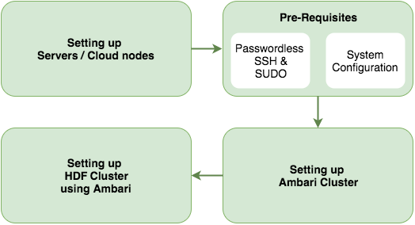
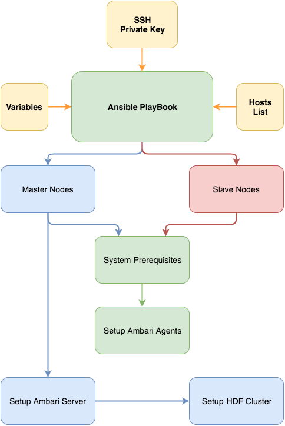
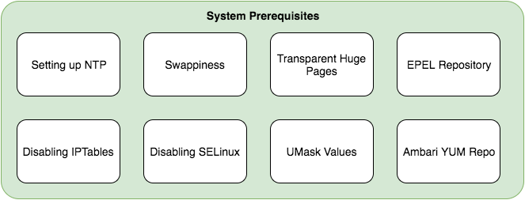
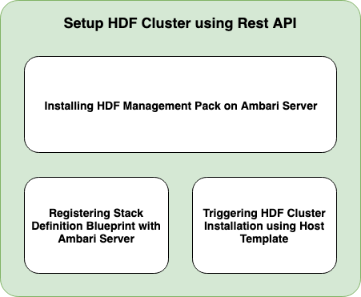

# Ansible-HDF-Automation

Deploying Ambari-HDF Cluster using Ansible and Ambari Blueprints

### Components Used
  - Ansible
  - Ambari Blueprints

#### Changes to following files need to be addressed

**Mandatory**
  - *hosts.ini* – Mention Hostnames on node as per the role
  - *ansible.cfg* – remote_user – SSH User with sudo credentials
  - *inventory/ssh-key.pem* – Private SSH key for password-less access

**Optional**
  - *variables.yaml* – Various Properties such as cluster_name, default_password and master Key, repo URL's etc.
  - *roles/setup_hdf/files/Blueprint.json* – Component Layout
  - *roles/setup_hdf/templates/Host_Mapping.json.j2* – Advanced properties and Hostname-Hostgroup Mapping

#### Demo Flow

#### Ansible Playbook Execution Flow

#### System Prerequisites Flow

#### Setting up HDF Cluster using Rest API - Ambari Blusprints

